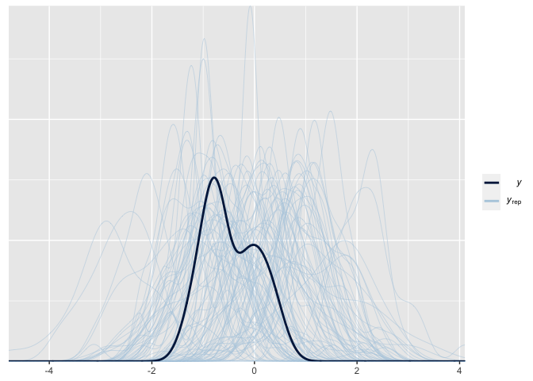
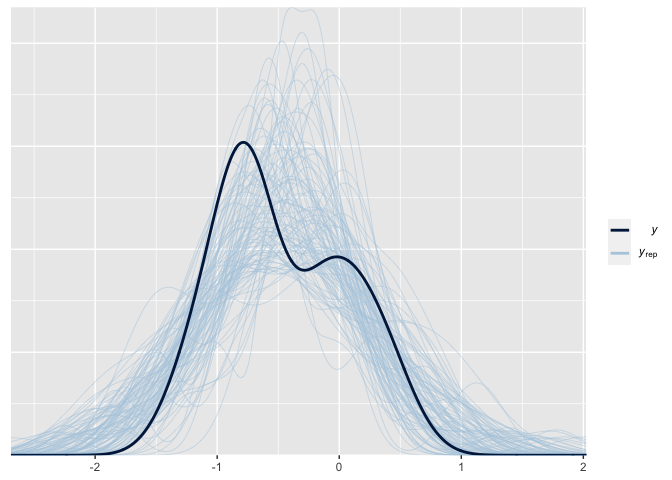
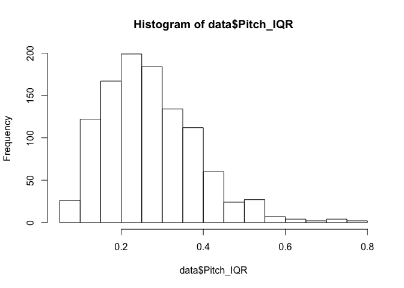
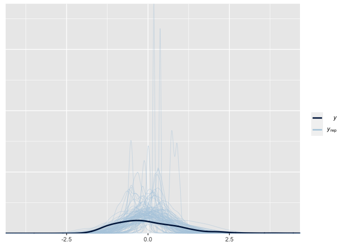

Assignment 4
------------

### Step 1: Perform a meta-analysis of pitch variability from previous studies of voice in ASD

``` r
#set global seed
seed = 9
# Loading packages
pacman::p_load(
  tidyverse, 
  metafor,
  brms) 

# Loading data
Meta_data <- read_tsv("Ass4_MetaAnalysisData.tsv")
```

    ## Parsed with column specification:
    ## cols(
    ##   .default = col_double(),
    ##   Paper = col_character(),
    ##   Author = col_character(),
    ##   Population = col_character(),
    ##   DiagnosisDetails = col_character(),
    ##   Language = col_character(),
    ##   Language2 = col_character(),
    ##   Task = col_character(),
    ##   Task2 = col_character(),
    ##   PitchMean_Units = col_character(),
    ##   PitchMeanASDvsTD = col_character(),
    ##   PitchRange_Units = col_character(),
    ##   PitchRangeASDvsTD = col_character(),
    ##   PitchSD_Units = col_character(),
    ##   PitchSDASDvsTD = col_character(),
    ##   PitchVariability_Units = col_character(),
    ##   PitchVariabilityASDvsTD = col_character(),
    ##   IntensityMean_Units = col_character(),
    ##   IntensityMeanASDvsTD = col_character(),
    ##   UtteranceDurationUnit = col_character(),
    ##   UtteranceDurationASDvsTD = col_character()
    ##   # ... with 5 more columns
    ## )

    ## See spec(...) for full column specifications.

``` r
# Tidying data (making sure the relevant variables are categorised correctly)
Meta_data <- Meta_data %>%
  mutate(
    PitchVariabilityASD_Mean = as.numeric(PitchVariabilityASD_Mean),
    PitchVariabilityTD_Mean = as.numeric(PitchVariabilityTD_Mean),
    PitchVariabilityASD_SD = as.numeric(PitchVariabilityASD_SD),
    PitchVariabilityTD_SD = as.numeric(PitchVariabilityTD_SD)
  )

# Only keeping the studies with data (the NA rows have no data all)
Meta_data <- Meta_data %>%
  subset(!is.na(Paper))

# Using escalc() to calculate Effect size (cohen's d) and Standard Error (uncertainty in the Cohen's d) per each study
Meta_data <- escalc(measure = "SMD", # Standardized mean difference
            n1i = TD_N, # Specifying group size of TD
            n2i = ASD_N, # Specifying group size of ASD
            m1i = PitchVariabilityTD_Mean, # Specifying mean of TD
            m2i = PitchVariabilityASD_Mean, # Specifying mean of ASD
            sd1i = PitchVariabilityTD_SD, # Specidying  SD of TD
            sd2i = PitchVariabilityASD_SD, # Specifying SD of ASD
            data = Meta_data, # DATA
            slab = Paper) # (Optional) - labels for the studies
#TD to ASD difference


# Renaming yi (effect size) and calcultting SE from vi (variance)
Meta_data <- Meta_data %>% 
  mutate(
    StandardError = sqrt(vi) # Why is this not the SD (vs. SE)
    ) %>%
  rename(
  EffectSize = yi
  )

# Looking at summary of the effect sizes and the standard errors
summary(Meta_data$EffectSize)
```

    ##     Min.  1st Qu.   Median     Mean  3rd Qu.     Max.     NA's 
    ## -1.29110 -0.81658 -0.65338 -0.46315 -0.05907  0.52031       11

``` r
summary(Meta_data$StandardError)
```

    ##    Min. 1st Qu.  Median    Mean 3rd Qu.    Max.    NA's 
    ##  0.2211  0.3176  0.3732  0.3673  0.4243  0.4826      11

``` r
#Pitch variability bigger in ASD than in TD

# Specifying a formula
#Basically calculating the average
Meta_formula <- bf(EffectSize | se(StandardError) ~ 1 + (1 | Paper))

# Defining priors
get_prior(Meta_formula, data = Meta_data, family = gaussian())
```

    ##                  prior     class      coef group resp dpar nlpar bound
    ## 1 student_t(3, -1, 10) Intercept                                      
    ## 2  student_t(3, 0, 10)        sd                                      
    ## 3                             sd           Paper                      
    ## 4                             sd Intercept Paper

``` r
Meta_prior <- c(
  prior(normal(0, 1), class = Intercept),
  prior(normal(0, .3), class = sd)
)

# Prior predictive check
Meta_m0 <- brm(
  Meta_formula,
  data = Meta_data,
  family = gaussian(),
  prior = Meta_prior,
  sample_prior = "only",
  chains = 2,
  cores = 2,
  seed = seed,
  file="MA_pc"
  )

pp_check(Meta_m0, nsamples = 100)
```



``` r
# Men dataen ser ud til at være binomial?

# Fitting the model
Meta_m1 <- brm(
  Meta_formula,
  data = Meta_data,
  family = gaussian(),
  prior = Meta_prior,
  sample_prior = T,
  chains = 2,
  cores = 2,
  seed = seed,
  file="MA_m0"
)

# Posterior predictive check
pp_check(Meta_m1, nsamples = 100)
```



``` r
# Looking at the estimates
summary(Meta_m1)
```

    ##  Family: gaussian 
    ##   Links: mu = identity; sigma = identity 
    ## Formula: EffectSize | se(StandardError) ~ 1 + (1 | Paper) 
    ##    Data: Meta_data (Number of observations: 30) 
    ## Samples: 2 chains, each with iter = 2000; warmup = 1000; thin = 1;
    ##          total post-warmup samples = 2000
    ## 
    ## Group-Level Effects: 
    ## ~Paper (Number of levels: 19) 
    ##               Estimate Est.Error l-95% CI u-95% CI Rhat Bulk_ESS Tail_ESS
    ## sd(Intercept)     0.35      0.10     0.16     0.55 1.00      908      779
    ## 
    ## Population-Level Effects: 
    ##           Estimate Est.Error l-95% CI u-95% CI Rhat Bulk_ESS Tail_ESS
    ## Intercept    -0.46      0.11    -0.67    -0.25 1.00     1011     1073
    ## 
    ## Samples were drawn using sampling(NUTS). For each parameter, Bulk_ESS
    ## and Tail_ESS are effective sample size measures, and Rhat is the potential
    ## scale reduction factor on split chains (at convergence, Rhat = 1).

``` r
# RESULTS: MA effect mean = 0.43, sd = 0.1 #vs. mean = -0.43, SD = 0.09

# Saving the results in variables to use later
Meta_mean <- fixef(Meta_m1)[[1]] # Defining the effect size of intercept as the mean
Meta_se <- fixef(Meta_m1)[[2]] # Defining the SD as mean_se (WHY SE?)

Meta_heterogeneity = 0.32 # Defining the sd(Intercept) (group-level effects) as heterogeneity
```

### Step 2: Analyse pitch variability in ASD in two new studies for which you have access to all the trials (not just study level estimates)

``` r
data <- read_csv("Ass4_data.csv", col_types = cols(ID = col_character()))

data <- data %>% mutate(
  PitchVariability = scale(Pitch_IQR)
)

hist(data$Pitch_IQR)
```



``` r
hist(data$PitchVariability)
```


``` r
#Looks shifted log normal, but gaussian is pretty close
```

### Step 3: Build a regression model predicting Pitch variability from Diagnosis.

Using uninformed, conservative priors

``` r
NewStudies_f0 <- bf(PitchVariability ~ 1 + Diagnosis + (1|ID))

get_prior(NewStudies_f0, data, family = gaussian())
```

    ##                 prior     class        coef group resp dpar nlpar bound
    ## 1                             b                                        
    ## 2                             b DiagnosisTD                            
    ## 3 student_t(3, 0, 10) Intercept                                        
    ## 4 student_t(3, 0, 10)        sd                                        
    ## 5                            sd                ID                      
    ## 6                            sd   Intercept    ID                      
    ## 7 student_t(3, 0, 10)     sigma

``` r
sd(data$PitchVariability)
```

    ## [1] 1

``` r
NS_prior0 <- c(
  prior(normal(0, .3), class = Intercept),
  prior(normal(0, .2), class = b),
  prior(normal(0, .2), class = sd),
  prior(normal(.5, .3), class = sigma)
)

NS_m0_pc <- brm(
  NewStudies_f0,
  data,
  family = gaussian(),
  prior = NS_prior0,
  sample_prior = "only",
  chains = 2,
  cores = 2,
  seed = seed,
  file="NS_m0_pc_f"
)

pp_check(NS_m0_pc, nsamples=100)
```


``` r
NS_m0 <- brm(
  NewStudies_f0,
  data,
  family = gaussian(),
  prior = NS_prior0,
  sample_prior = T,
  chains = 2,
  cores = 2,
  #seed = seed,
  file="NS_m0_malate_f"
)
pp_check(NS_m0, nsamples=100)
```


``` r
#Because we have seen in the meta analysis, that there is less variance in TD
plot(hypothesis(NS_m0, "DiagnosisTD < 0"))
```


``` r
hypothesis(NS_m0, "DiagnosisTD < 0")
```

    ## Hypothesis Tests for class b:
    ##          Hypothesis Estimate Est.Error CI.Lower CI.Upper Evid.Ratio Post.Prob
    ## 1 (DiagnosisTD) < 0    -0.13      0.11     -0.3     0.04       8.62       0.9
    ##   Star
    ## 1     
    ## ---
    ## 'CI': 90%-CI for one-sided and 95%-CI for two-sided hypotheses.
    ## '*': For one-sided hypotheses, the posterior probability exceeds 95%;
    ## for two-sided hypotheses, the value tested against lies outside the 95%-CI.
    ## Posterior probabilities of point hypotheses assume equal prior probabilities.

``` r
summary(NS_m0)
```

    ##  Family: gaussian 
    ##   Links: mu = identity; sigma = identity 
    ## Formula: PitchVariability ~ 1 + Diagnosis + (1 | ID) 
    ##    Data: data (Number of observations: 1074) 
    ## Samples: 2 chains, each with iter = 2000; warmup = 1000; thin = 1;
    ##          total post-warmup samples = 2000
    ## 
    ## Group-Level Effects: 
    ## ~ID (Number of levels: 149) 
    ##               Estimate Est.Error l-95% CI u-95% CI Rhat Bulk_ESS Tail_ESS
    ## sd(Intercept)     0.73      0.05     0.64     0.82 1.00      587      979
    ## 
    ## Population-Level Effects: 
    ##             Estimate Est.Error l-95% CI u-95% CI Rhat Bulk_ESS Tail_ESS
    ## Intercept       0.29      0.08     0.12     0.45 1.01      383      742
    ## DiagnosisTD    -0.13      0.11    -0.34     0.08 1.00      429      820
    ## 
    ## Family Specific Parameters: 
    ##       Estimate Est.Error l-95% CI u-95% CI Rhat Bulk_ESS Tail_ESS
    ## sigma     0.70      0.02     0.67     0.73 1.00     2540     1591
    ## 
    ## Samples were drawn using sampling(NUTS). For each parameter, Bulk_ESS
    ## and Tail_ESS are effective sample size measures, and Rhat is the potential
    ## scale reduction factor on split chains (at convergence, Rhat = 1).

``` r
plot(NS_m0)
```


``` r
NS_m0 <- add_criterion(NS_m0, criterion = "loo", reloo = T)
```

    ## No problematic observations found. Returning the original 'loo' object.

    ## Automatically saving the model object in 'NS_m0_malate_f.rds'

### Step 4: Now re-run the model with the meta-analytic prior

``` r
NS_informed_prior0 <- c(
  prior(normal(.0, .3), class = Intercept),
  prior(normal(-0.4528398, 0.2), class = b),
  prior(normal(0, .2), class = sd),
  prior(normal(.32, .3), class = sigma)
)


NS_informed_m0_pc <- brm(
  NewStudies_f0,
  data,
  family = gaussian(),
  prior = NS_informed_prior0,
  sample_prior = "only",
  chains = 2,
  cores = 2,
  #seed = seed,
  file="NS_in_pc_f"
)

pp_check(NS_informed_m0_pc, nsamples = 100)
```



``` r
NS_informed_m0 <- brm(
  NewStudies_f0,
  data,
  family = gaussian(),
  prior = NS_informed_prior0,
  sample_prior = T,
  chains = 2,
  cores = 2,
  #seed=seed,
  file="NS_informed_m0_malte_f"
)

pp_check(NS_informed_m0, nsamples = 100)
```


``` r
plot(hypothesis(NS_informed_m0, "DiagnosisTD < 0"))
```


``` r
hypothesis(NS_informed_m0, "DiagnosisTD < 0")
```

    ## Hypothesis Tests for class b:
    ##          Hypothesis Estimate Est.Error CI.Lower CI.Upper Evid.Ratio Post.Prob
    ## 1 (DiagnosisTD) < 0    -0.27      0.11    -0.45    -0.09         99      0.99
    ##   Star
    ## 1    *
    ## ---
    ## 'CI': 90%-CI for one-sided and 95%-CI for two-sided hypotheses.
    ## '*': For one-sided hypotheses, the posterior probability exceeds 95%;
    ## for two-sided hypotheses, the value tested against lies outside the 95%-CI.
    ## Posterior probabilities of point hypotheses assume equal prior probabilities.

``` r
summary(NS_informed_m0)
```

    ##  Family: gaussian 
    ##   Links: mu = identity; sigma = identity 
    ## Formula: PitchVariability ~ 1 + Diagnosis + (1 | ID) 
    ##    Data: data (Number of observations: 1074) 
    ## Samples: 2 chains, each with iter = 2000; warmup = 1000; thin = 1;
    ##          total post-warmup samples = 2000
    ## 
    ## Group-Level Effects: 
    ## ~ID (Number of levels: 149) 
    ##               Estimate Est.Error l-95% CI u-95% CI Rhat Bulk_ESS Tail_ESS
    ## sd(Intercept)     0.73      0.05     0.64     0.82 1.00      572     1034
    ## 
    ## Population-Level Effects: 
    ##             Estimate Est.Error l-95% CI u-95% CI Rhat Bulk_ESS Tail_ESS
    ## Intercept       0.36      0.08     0.20     0.52 1.00      502      888
    ## DiagnosisTD    -0.27      0.11    -0.48    -0.06 1.00      614     1016
    ## 
    ## Family Specific Parameters: 
    ##       Estimate Est.Error l-95% CI u-95% CI Rhat Bulk_ESS Tail_ESS
    ## sigma     0.70      0.02     0.67     0.73 1.00     3439     1633
    ## 
    ## Samples were drawn using sampling(NUTS). For each parameter, Bulk_ESS
    ## and Tail_ESS are effective sample size measures, and Rhat is the potential
    ## scale reduction factor on split chains (at convergence, Rhat = 1).

``` r
NS_informed_m0 <- add_criterion(NS_informed_m0, criterion = "loo", reloo = T)
```

    ## No problematic observations found. Returning the original 'loo' object.

    ## Automatically saving the model object in 'NS_informed_m0_malte_f.rds'

### Step 5: Compare the models

``` r
loo_model_weights(NS_m0, NS_informed_m0)
```

    ## Warning: Some Pareto k diagnostic values are too high. See help('pareto-k-diagnostic') for details.

    ## Warning: Some Pareto k diagnostic values are too high. See help('pareto-k-diagnostic') for details.

    ## Method: stacking
    ## ------
    ##                weight
    ## NS_m0          0.000 
    ## NS_informed_m0 1.000

``` r
loo_compare(NS_m0, NS_informed_m0)
```

    ##                elpd_diff se_diff
    ## NS_informed_m0  0.0       0.0   
    ## NS_m0          -1.9       1.2

``` r
plot(hypothesis(NS_m0, "DiagnosisTD < 0"))
```


``` r
plot(hypothesis(NS_informed_m0, "DiagnosisTD < 0"))
```


